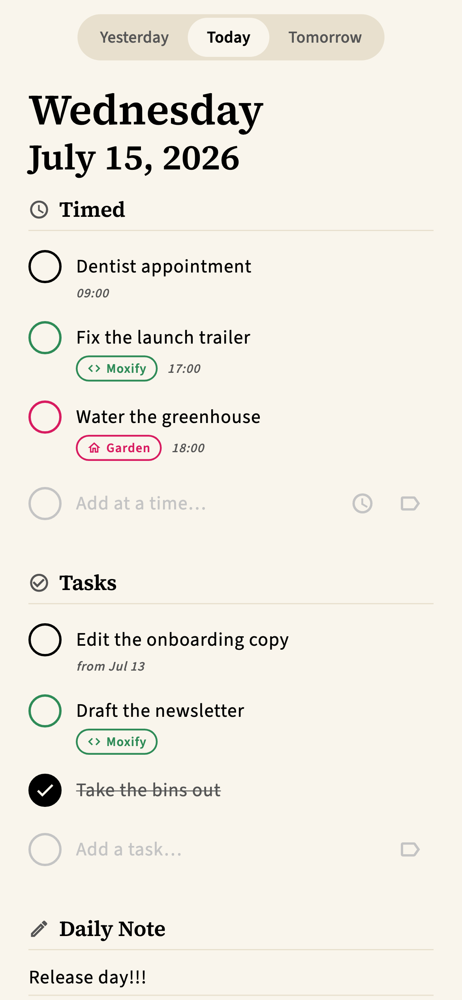
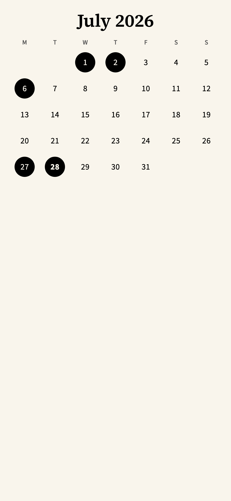
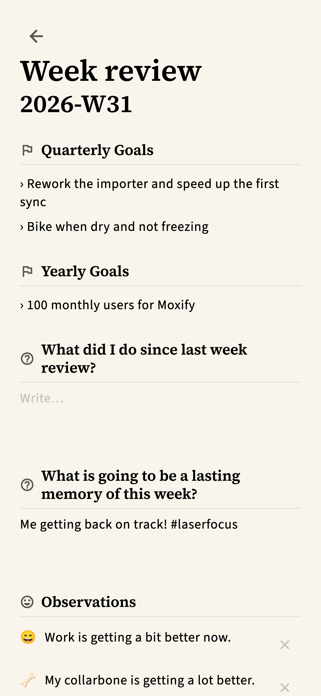
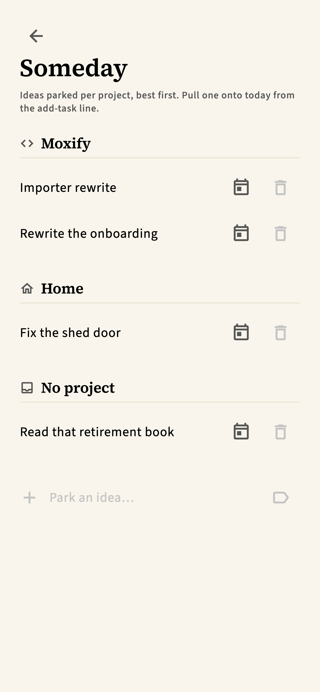
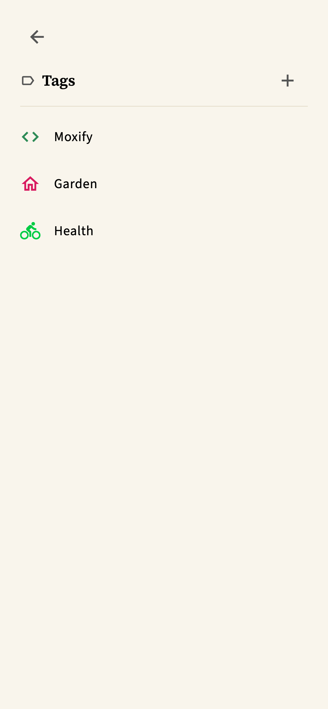
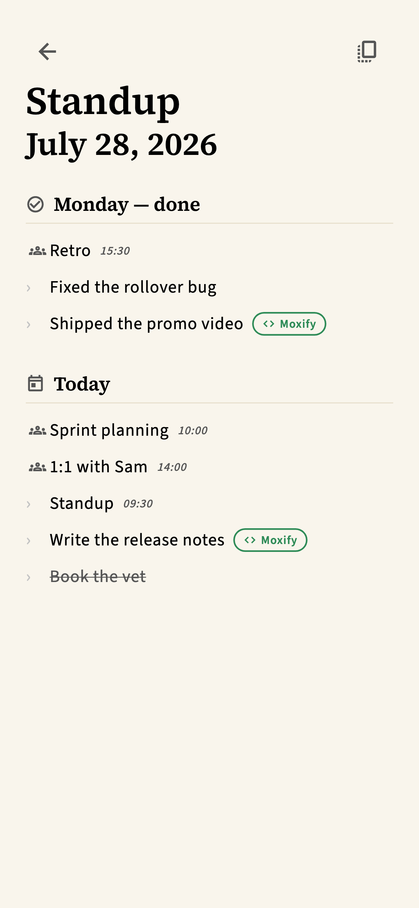
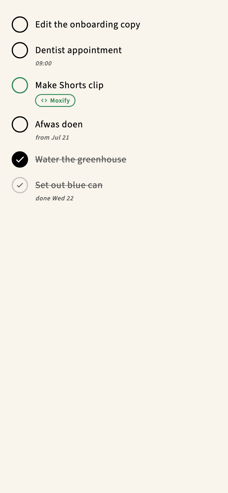
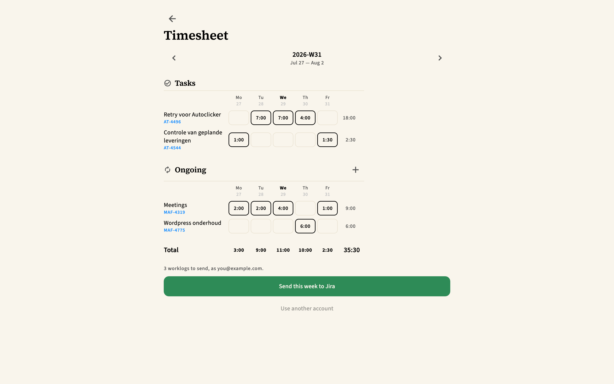
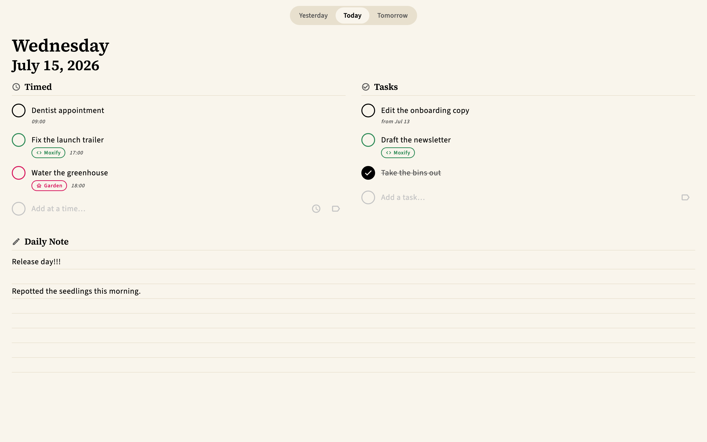
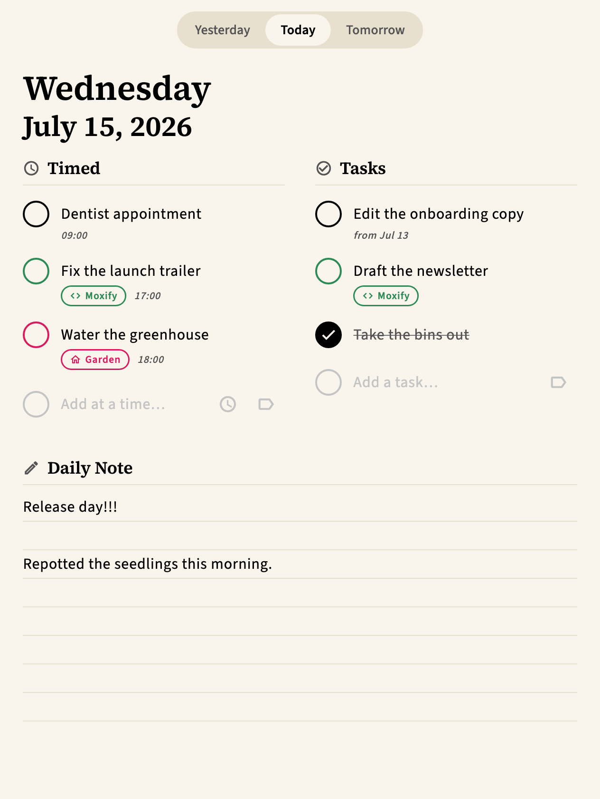

<div align="center">


# Seedling

**A daily-planning notebook that runs on your phone, your Mac, and a colour e-ink tablet.**

One page per day: what's on your calendar, what you mean to do, and how it went.
Paper and serif, big round checkboxes, and nothing that blinks at you.

</div>

<div align="center">

&nbsp;

&nbsp;

</div>

---

## What it does

**A day at a time.** Timed appointments read straight from your calendar, interleaved
with anything you gave a time to. Untimed tasks below. A note at the bottom. Swipe
left and right through the days; after Sunday you land on that week's review, where
you'd write it anyway rather than behind a button.

**Tasks roll over, and history stays put.** An unfinished task follows you to today.
Check it off anywhere and it stops following — but it stays on the days it was already
on, drawn as history rather than erased. Snooze it to a date, or send it back to
someday.

**Someday lists, per project.** Ideas parked against a tag, best first, pulled onto a
day when you're ready. Drag them between projects when you file one wrong.

<div align="center">

&nbsp;

</div>

**Daily check-offs.** A handful of questions you answer in a tap — cycled to the gym,
how you travelled. Once they're all answered the block folds itself into one line
beside the date and gets out of the way.

**Your calendar, on your terms.** Appointments are only ever *read*; Seedling never
writes to your calendar. Ones you don't want to see get hidden — by series, so hiding
a daily standup hides every occurrence — with a long-press on the date to reveal them
again when you hide one by mistake.

**Standup.** Three taps on the date gives you yesterday's finished work and today's
list, meetings included, read-only so you can't tick something off mid-sentence. A
button copies it as Slack bullets.

<div align="center">

&nbsp;

</div>

**Time tracking that reaches Jira.** Log quarter-hours against a task, or against a
meeting — an hour in a meeting is an hour spent. The timesheet lays the week out as a
grid: the ticketed work you did, and the standing rows (meetings, maintenance) that
never become tasks. One button writes it all as native Jira worklogs, which is what
Clockwork reports on.

<div align="center">

</div>

**Everything ends up as Markdown.** The Mac mirrors every day, review and list into a
folder of `.md` files as you type — one way, never read back — so you can point an
agent or Obsidian at your own archive.

## Three screens, one notebook

|  |  |
|---|---|
| **iPhone** | The everyday one. Reads the calendar and shares it with the others. |
| **macOS** | Wide two-column layout, the Markdown vault, the Jira timesheet. |
| **BigMe B7** | Colour e-ink. A high-contrast mode built on the fifteen colours that panel can actually show — no mid-greys, no animation. |

<div align="center">

&nbsp;

</div>

macOS has no calendar API and the e-ink tablet has no calendar account, so the phone
publishes what it reads to Firestore and the other two read that. A device whose own
calendar comes back empty falls through to the shared one on its own.

## Running it

Flutter 3.44.2, via [fvm](https://fvm.app).

```bash
fvm flutter pub get
fvm flutter run -d macos      # or -d <your iPhone>
fvm flutter test
```

You'll need a Firebase project of your own with Firestore and email/password auth
enabled, then `flutterfire configure`. The rules in [`firestore.rules`](firestore.rules)
scope everything to `users/{uid}` — there is no shared or public data.

> The committed Firebase config files are client *identifiers*, not secrets — they
> ship inside every build of any Firebase app. [`SECURITY.md`](SECURITY.md) explains
> what protects the data instead, and the one thing worth switching off.

## How it's built

No state-management package, no code generation, no architecture astronautics.

- **`lib/logic/`** — pure functions, no Flutter imports. Rollover rules, day and week
  keys, duration parsing, the timesheet grid, what to send to Jira. Everything fiddly
  lives here because everything here is trivially testable.
- **`lib/data/`** — one repository over Firestore, plus the calendar sources and the
  Markdown exporter.
- **`lib/screens/`, `lib/widgets/`** — each screen splits into a pure view that takes
  data and callbacks, and a thin live wrapper that feeds it streams. The pure half is
  what the golden tests render.

**Every widget and page has a golden test**, at four canonical sizes — phone, e-ink,
narrow Mac, wide Mac. The screenshots above *are* those goldens, so they cannot drift
from the app: the build fails if they do.

Two long-form documents carry the reasoning that code can't —
[`decisions.md`](decisions.md), which records why things are the way they are including
the ones that turned out wrong, and [`engineering.md`](engineering.md) for the
mechanics. Every folder has a `README.md`.

## A note on the calendar

Seedling reads your calendar and never writes to it. Ticking off an appointment,
tagging it, logging time against it — all of that lives in Seedling. Your calendar is
somebody else's source of truth, and this app treats it that way.

---

<div align="center">

Built by [Bas de Vaan](https://github.com/Bassiuz) · MIT

</div>
